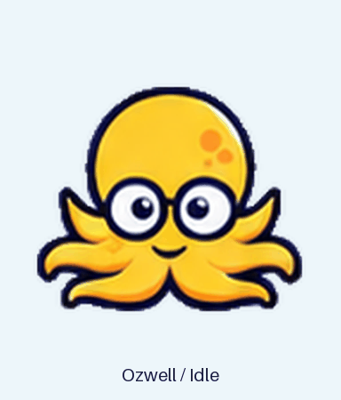

# Ozwell

Ozwell is a cheerful yellow octopus with round navy glasses, packaged as a custom pet for the Codex / ChatGPT desktop app.



## Install

### npx (macOS and Windows)

With Node.js 22 or newer and Git installed, run:

```sh
npx --yes github:mieweb/petozwell
```

This installs the bundled pet into your Codex home. It runs directly from GitHub and does not require an npm account. For the specific 1.0.0 release, use `github:mieweb/petozwell#v1.0.0` instead.

If Git is unavailable, use the release tarball:

```sh
npx --yes --package=https://github.com/mieweb/petozwell/releases/download/v1.0.0/petozwell-1.0.0.tgz petozwell
```

Options work with either command:

```sh
npx --yes github:mieweb/petozwell --dry-run
npx --yes github:mieweb/petozwell --codex-home "/path/to/codex home"
npx --yes github:mieweb/petozwell --force
```

An identical installation is left in place. If existing files differ, the installer stops; `--force` first saves the whole previous folder under `CODEX_HOME/pet-backups/` and then installs the new copy. A custom `CODEX_HOME` environment variable is honored. `--codex-home` takes precedence.

The short registry command `npx petozwell` is not published. Use the GitHub commands above.

### Homebrew (macOS)

```sh
brew tap mieweb/petozwell https://github.com/mieweb/petozwell.git
brew install mieweb/petozwell/petozwell
petozwell
```

Homebrew installs Node.js if needed and provides the `petozwell` command. Run `petozwell` as your normal user to copy Ozwell into your own Codex home. It accepts the same `--dry-run`, `--codex-home`, and `--force` options as the npx installer.

To upgrade later, run `brew update`, then `brew upgrade petozwell`, and rerun `petozwell`. If the artwork changed, use `petozwell --force` to preserve a backup and install the update. Removing the Homebrew formula removes the installer; it leaves your selected pet files in your Codex home.

### Manual installation

Download this repository using **Code → Download ZIP** and extract it, or clone it:

```sh
git clone https://github.com/mieweb/petozwell.git
```

Install the **ozwell** folder containing `pet.json` and `spritesheet.png`. Keep the two files together.

### macOS

1. In Finder, choose **Go → Go to Folder** (`Shift–Command–G`).
2. Enter `~/.codex`. Create a folder named `pets` inside it if needed.
3. Copy the extracted **ozwell** folder into **pets**.

The final files should be:

```text
~/.codex/pets/ozwell/pet.json
~/.codex/pets/ozwell/spritesheet.png
```

### Windows

1. Press `Win+R`, enter `%USERPROFILE%\.codex`, and press Enter.
2. Create a folder named `pets` inside it if needed. If `.codex` does not exist, create it in `%USERPROFILE%` first.
3. Copy the extracted **ozwell** folder into **pets**.

The final files should be:

```text
%USERPROFILE%\.codex\pets\ozwell\pet.json
%USERPROFILE%\.codex\pets\ozwell\spritesheet.png
```

If your organization sets a custom `CODEX_HOME`, install into its `pets` folder instead. Codex CLI inside WSL normally uses a separate Linux home; the Windows desktop app's default home is in the Windows user profile.

### Select Ozwell

Open **Settings → Pets**, select **Refresh**, then choose **Ozwell**. If he is hidden, choose **Wake Pet** from the command menu, or enter `/pet`.

If an Ozwell folder is already installed, keep a backup before replacing it. Refresh the pet list after an update.

## Company distribution

Share the repository or a distribution ZIP through your internal file-sharing service. IT can also copy the two files into each user's Codex home under `pets/ozwell`. Each user selects Ozwell in the app.

Test on one coworker's app version before a broad rollout. Installing the files does not automatically select the pet.

## Compatibility

- Sprite version: **2**.
- Format: transparent RGBA PNG, **1536 × 2288** pixels.
- Layout: **8 columns × 11 rows**, with **192 × 208** pixel cells.
- Includes idle, movement, waving, jumping, failure, waiting, working, review, and directional gaze frames.
- The package dimensions and manifest were checked against the desktop app installed on September 8, 2026. The installer is covered by Windows CI; pet rendering in the Windows app has not been tested.
- The documented web uploader requires **1536 × 1872** pixels as of September 9, 2026. This desktop sheet would need a separate compatible export for that uploader.

## Build a distribution ZIP

Python 3 is needed only to build the ZIP; coworkers do not need Python to install the pet.

```sh
python3 scripts/build_package.py
```

On Windows:

```powershell
py -3 scripts/build_package.py
```

The script checks the manifest and PNG header, then writes `dist/ozwell-company.zip` with installation instructions, previews, and the pet folder. Generated archives are excluded from Git.

## Develop and release the installer

The installer has no npm dependencies or install-time scripts.

```sh
npm run check
npm test
npm pack --pack-destination dist
```

CI runs the installer tests on macOS, Windows, and Linux. Tests use temporary Codex homes and leave the real installation alone.

For a new version, update `package.json`, run the checks, and create an npm tarball with `npm pack --pack-destination dist`. Publish the tarball on the corresponding GitHub release. Update `Formula/petozwell.rb` with that release URL and the tarball's SHA-256, and update the pinned release examples above. Publishing to the npm registry is optional and requires a maintainer's npm credentials.

## Artwork

The artwork was generated from a supplied yellow octopus reference. Python processing removed the generated background and aligned the animation frames. The installed pet consists of its manifest and image; animation behavior is supplied by the app.

## Official documentation

- [Pets](https://learn.chatgpt.com/docs/pets)
- [Windows desktop app](https://learn.chatgpt.com/docs/windows/windows-app)
